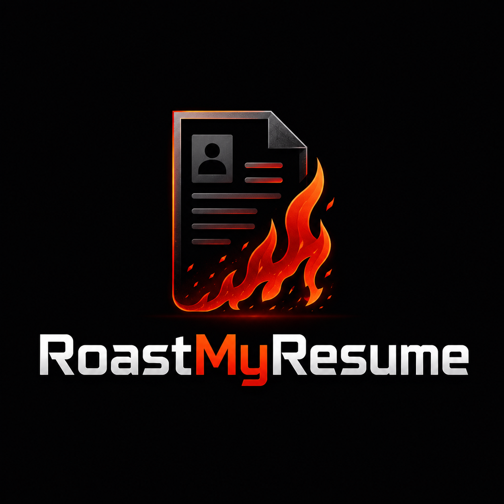
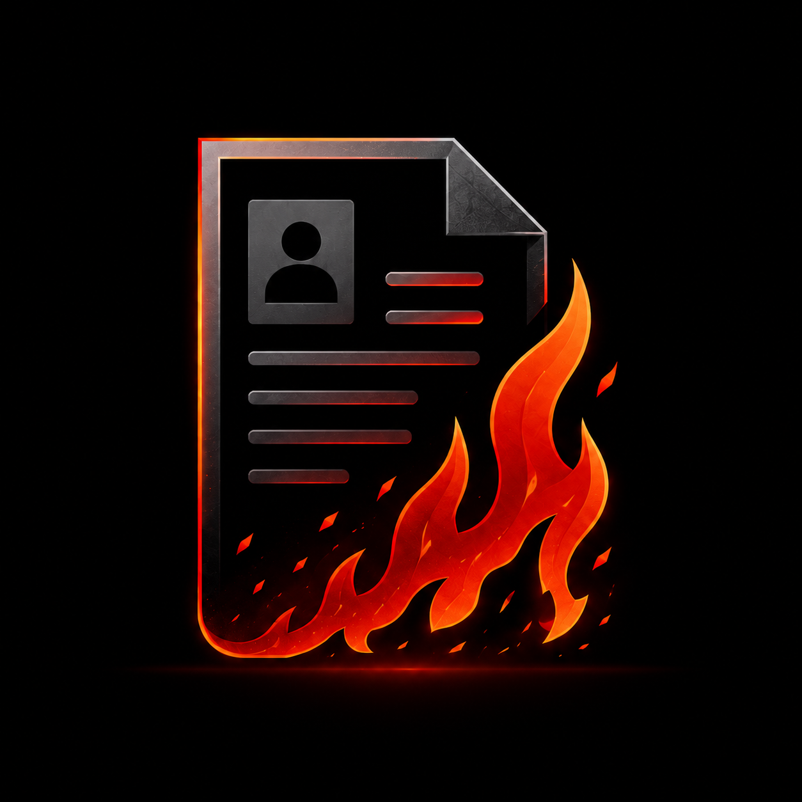

<div align="center">



# 🔥 RoastMyResume

### Roast. Repair. Rise.

**An AI-powered resume roasting and healing web app that brutally exposes weak resumes, then rebuilds them into recruiter-ready documents.**

Because sometimes your resume does not need “minor improvements.”
Sometimes it needs to be dragged, roasted, rebuilt, and sent back into society with a fresh personality.

---


</div>

---

## 📌 Table of Contents

* [About RoastMyResume](#-about-roastmyresume)
* [Project Personality](#-project-personality)
* [Core Features](#-core-features)
* [Screenshots](#-screenshots)
* [Tech Stack](#-tech-stack)
* [Project Structure](#-project-structure)
* [How It Works](#-how-it-works)
* [Frontend Pages](#-frontend-pages)
* [Backend API Overview](#-backend-api-overview)
* [Installation Guide](#-installation-guide)
* [Environment Variables](#-environment-variables)
* [Running the Project](#-running-the-project)
* [Testing the App](#-testing-the-app)
* [Premium Feature: Healing Journey](#-premium-feature-healing-journey)
* [LinkedIn Sharing](#-linkedin-sharing)
* [Security Notes](#-security-notes)
* [Future Improvements](#-future-improvements)
* [Author](#-author)
* [License](#-license)

---

## 🔥 About RoastMyResume

**RoastMyResume** is a full-stack AI web application that allows users to upload their resume in **PDF** or **DOCX** format and receive a brutally honest, funny, structured roast of their resume.

But the app does not stop at emotional damage.

After roasting the resume, the user can use the **Heal Me** feature to rewrite and improve the resume for a specific role, company, and professional tone. The improved resume can then be downloaded as a **PDF** or **DOCX** through the premium feature called **Healing Journey**.

This project combines:

* AI resume analysis
* File parsing
* Resume rewriting
* Premium download flow
* LinkedIn sharing
* Modern dark fire-themed UI
* Full-stack React + Node architecture

In simple words:

> Upload resume.
> Get roasted.
> Cry professionally.
> Heal resume.
> Apply with confidence.

---

## 😈 Project Personality

RoastMyResume is not a boring resume checker.

It has personality.

It is:

* Brutal but useful
* Funny but professional
* Dark-themed but clean
* Honest but safe
* Mean to weak resumes, not to people
* Designed like your resume is standing in front of a hiring manager and sweating

The app uses three roast intensity levels:

| Level | Name              | Description                                                |
| ----- | ----------------- | ---------------------------------------------------------- |
| 1     | **Savage**        | Sharp, funny, sarcastic feedback                           |
| 2     | **Brutal**        | Direct, harsh, recruiter-style honesty                     |
| 3     | **Make Me Bleed** | Maximum professional embarrassment, without unsafe content |

The roasting is intense, but it stays focused on the resume, writing quality, formatting, effort, clarity, and career presentation.

---

## ✨ Core Features

### 🔥 Resume Roasting

Users can upload a resume and select a roast level.

The AI analyzes the resume and returns a structured roast report including:

* Resume score
* Overall roast
* Biggest problems
* Section-by-section feedback
* Quick fixes
* Final verdict
* LinkedIn share text

---

### 🌿 Heal Me Mode

After the resume gets roasted, users can use the **Heal Me** feature.

The user provides:

* Resume file
* Target role
* Target company
* Preferred tone

The AI then rewrites the resume into a more polished and recruiter-ready version.

---

### 📄 PDF and DOCX Download

The healed resume can be downloaded in:

* `.docx`
* `.pdf`

This is part of the **Healing Journey** premium feature.

---

### 💳 Healing Journey Premium

The app includes a demo payment page with a professional card UI.

Current version:

* Uses mock checkout
* Returns a demo premium token
* Does not process real payment data
* Does not store card details

Production version should use:

* Stripe
* JazzCash
* EasyPaisa
* PayPal
* or another secure payment provider

---

### 🔗 LinkedIn Share Feature

The app can generate LinkedIn-style post content based on the roast result.

Current version:

* Generates post preview
* Allows copy/share style workflow
* Opens LinkedIn sharing flow

Direct LinkedIn posting would require LinkedIn OAuth and official API approval.

---

### 👤 Profile Page

The profile page is inspired by professional LinkedIn-style details.

Users can add:

* Full name
* Professional headline
* Location
* Email
* Phone
* LinkedIn URL
* GitHub URL
* Portfolio
* Target role
* Target companies
* About section
* Skills
* Experience
* Projects
* Education
* Certifications

This can later be connected to a real database.

---

### 📊 Dashboard

The dashboard gives users a professional command center for:

* Resume roast history
* Healed resume count
* Profile strength
* Premium status
* Recent activity
* Resume health indicators
* Quick actions

---

### 📱 Responsive UI

The frontend includes:

* Responsive navbar
* Hamburger menu
* Footer
* Separate pages
* Mobile-friendly layout
* Dark fire theme
* Heal mode mint/blue theme

---

## 🖼️ Screenshots

> Add your screenshots inside a folder like this:

```txt
docs/
└── screenshots/
    ├── home.png
    ├── dashboard.png
    ├── roast.png
    ├── heal.png
    ├── profile.png
    ├── payment.png
    ├── signin.png
    └── signup.png
```

Then GitHub will show them here:

---

### 🏠 Home Page


---

### 📊 Dashboard


---

### 🔥 Roast Page


---

### 🌿 Heal Page


---

### 👤 Profile Page


---

### 💳 Payment Page


---

### 🔐 Sign In Page


---

### 📝 Sign Up Page


---

## 🛠️ Tech Stack

### Frontend

| Technology       | Purpose                  |
| ---------------- | ------------------------ |
| React            | UI development           |
| Vite             | Fast frontend build tool |
| React Router DOM | Page routing             |
| Tailwind CSS     | Styling                  |
| Lucide React     | Icons                    |
| JavaScript       | Frontend logic           |

---

### Backend

| Technology         | Purpose                     |
| ------------------ | --------------------------- |
| Node.js            | Runtime                     |
| Express.js         | API server                  |
| Groq SDK           | AI response generation      |
| Multer             | File upload handling        |
| PDF Parse          | PDF text extraction         |
| Mammoth            | DOCX text extraction        |
| DOCX               | DOCX resume generation      |
| Zod                | Validation                  |
| Helmet             | Security headers            |
| CORS               | Frontend/backend connection |
| Express Rate Limit | Basic API protection        |
| Dotenv             | Environment variables       |

---

## 📁 Project Structure

```txt
RoastMyResume/
├── backend/
│   ├── src/
│   │   ├── config/
│   │   │   └── env.js
│   │   │
│   │   ├── controllers/
│   │   │   ├── download.controller.js
│   │   │   ├── heal.controller.js
│   │   │   ├── linkedin.controller.js
│   │   │   ├── payment.controller.js
│   │   │   └── roast.controller.js
│   │   │
│   │   ├── middleware/
│   │   │   ├── error.middleware.js
│   │   │   ├── premium.middleware.js
│   │   │   └── upload.middleware.js
│   │   │
│   │   ├── routes/
│   │   │   ├── download.routes.js
│   │   │   ├── heal.routes.js
│   │   │   ├── linkedin.routes.js
│   │   │   ├── payment.routes.js
│   │   │   └── roast.routes.js
│   │   │
│   │   ├── services/
│   │   │   ├── fileParser.service.js
│   │   │   ├── groq.service.js
│   │   │   ├── healPrompt.service.js
│   │   │   ├── linkedin.service.js
│   │   │   ├── resumeBuilder.service.js
│   │   │   └── roastPrompt.service.js
│   │   │
│   │   ├── uploads/
│   │   │   └── .gitkeep
│   │   │
│   │   ├── utils/
│   │   │   ├── ApiError.js
│   │   │   └── cleanText.js
│   │   │
│   │   ├── app.js
│   │   └── server.js
│   │
│   ├── .env
│   ├── .env.example
│   └── package.json
│
├── frontend/
│   ├── public/
│   │   ├── logo.png
│   │   └── logof.png
│   │
│   ├── src/
│   │   ├── api/
│   │   │   └── resumeApi.js
│   │   │
│   │   ├── components/
│   │   │   ├── BrandLogo.jsx
│   │   │   ├── Footer.jsx
│   │   │   ├── HealMeSection.jsx
│   │   │   ├── LinkedInButton.jsx
│   │   │   ├── Navbar.jsx
│   │   │   ├── PageLayout.jsx
│   │   │   ├── RoastPanel.jsx
│   │   │   └── RoastResult.jsx
│   │   │
│   │   ├── pages/
│   │   │   ├── DashboardPage.jsx
│   │   │   ├── Heal.jsx
│   │   │   ├── Home.jsx
│   │   │   ├── Payment.jsx
│   │   │   ├── Profile.jsx
│   │   │   ├── Roast.jsx
│   │   │   ├── SignIn.jsx
│   │   │   └── SignUp.jsx
│   │   │
│   │   ├── styles/
│   │   │   └── index.css
│   │   │
│   │   ├── utils/
│   │   │   └── constants.js
│   │   │
│   │   ├── App.jsx
│   │   └── main.jsx
│   │
│   ├── index.html
│   ├── package.json
│   └── vite.config.js
│
├── docs/
│   └── screenshots/
│
├── .gitignore
└── README.md
```

---

## ⚙️ How It Works

### Step 1: User Uploads Resume

The user uploads a `.pdf` or `.docx` resume from the frontend.

The file is sent to the backend using `FormData`.

---

### Step 2: Backend Parses Resume

The backend extracts text from the uploaded file.

* PDF files are parsed using `pdf-parse`
* DOCX files are parsed using `mammoth`

The extracted text is cleaned before being sent to the AI.

---

### Step 3: AI Generates Roast

The backend builds a structured prompt based on the selected roast level.

Then Groq generates a JSON response containing:

* Score
* Roast summary
* Biggest problems
* Section feedback
* Fixes
* Final verdict

---

### Step 4: Frontend Displays Roast Report

The frontend renders the report in a fire-themed interface.

The user can read the roast, copy/share LinkedIn content, or move to Heal Me mode.

---

### Step 5: Heal Me Rewrites Resume

The user uploads the resume again and enters:

* Target role
* Target company
* Tone

The backend sends the resume text and targeting details to Groq.

The AI returns an improved resume structure.

---

### Step 6: User Downloads Resume

If premium is unlocked, the user can download the healed resume as:

* PDF
* DOCX

---

## 🧭 Frontend Pages

| Page      | Route        | Description                             |
| --------- | ------------ | --------------------------------------- |
| Home      | `/`          | Landing page with project intro         |
| Dashboard | `/dashboard` | User command center                     |
| Roast     | `/roast`     | Resume upload and roast level selection |
| Heal      | `/heal`      | Resume rewriting page                   |
| Profile   | `/profile`   | LinkedIn-style professional profile     |
| Payment   | `/payment`   | Healing Journey premium checkout UI     |
| Sign In   | `/signin`    | Login page UI                           |
| Sign Up   | `/signup`    | Signup page UI                          |

---

## 🔌 Backend API Overview

### Health Check

```http
GET /api/health
```

Checks whether the backend is running.

---

### Roast Levels

```http
GET /api/roast/levels
```

Returns available roast intensity levels.

---

### Roast Resume

```http
POST /api/roast
```

Uploads and roasts a resume.

Form data:

| Field  | Type          | Required |
| ------ | ------------- | -------- |
| resume | PDF/DOCX file | Yes      |
| level  | string        | Yes      |

Accepted levels:

```txt
savage
brutal
make_me_bleed
```

---

### Heal Resume

```http
POST /api/heal
```

Uploads and rewrites a resume.

Form data:

| Field         | Type          | Required |
| ------------- | ------------- | -------- |
| resume        | PDF/DOCX file | Yes      |
| targetRole    | string        | Yes      |
| targetCompany | string        | Optional |
| tone          | string        | Optional |

---

### Download Healed Resume

```http
POST /api/download/healed-resume
```

Downloads healed resume as PDF or DOCX.

Requires premium token header:

```http
x-premium-token: healing-journey-unlocked
```

---

### Mock Payment Checkout

```http
POST /api/payment/checkout
```

Returns a demo premium token.

---

### LinkedIn Share Preview

```http
POST /api/linkedin/preview
```

Generates LinkedIn post preview text.

---

### LinkedIn Share

```http
POST /api/linkedin/share
```

Creates LinkedIn share payload or share URL.

---

## 💻 Installation Guide

### 1. Clone the Repository

```bash
git clone <your-repository-url>
cd RoastMyResume
```

---

### 2. Install Backend Dependencies

```bash
cd backend
npm install
```

---

### 3. Install Frontend Dependencies

Open another terminal:

```bash
cd frontend
npm install
```

---

## 🔐 Environment Variables

Create a `.env` file inside the backend folder:

```txt
backend/.env
```

Use this format:

```env
PORT=5000
NODE_ENV=development
CLIENT_URL=http://localhost:5173
GROQ_API_KEY=your_groq_api_key_here
GROQ_MODEL=llama-3.3-70b-versatile
MAX_FILE_SIZE_MB=5
DEV_UNLOCK_PREMIUM=false
LINKEDIN_SHARE_URL=https://www.linkedin.com/sharing/share-offsite/
```

### Important

Never commit your real `.env` file.

Your `.gitignore` should include:

```gitignore
.env
node_modules/
dist/
backend/src/uploads/*
!backend/src/uploads/.gitkeep
```

---

## 🚀 Running the Project

### Start Backend

```bash
cd backend
npm run dev
```

Backend runs on:

```txt
http://localhost:5000
```

Expected output:

```txt
🔥 RoastMyResume backend started
🚀 Server running on http://localhost:5000
```

---

### Start Frontend

Open a second terminal:

```bash
cd frontend
npm run dev
```

Frontend runs on:

```txt
http://localhost:5173
```

---

## 🧪 Testing the App

### Backend Health Test

```powershell
Invoke-RestMethod http://localhost:5000/api/health
```

Expected result:

```txt
success status  service             environment
------- ------  -------             -----------
True    healthy RoastMyResume API   development
```

---

### Payment API Test

```powershell
Invoke-RestMethod http://localhost:5000/api/payment/checkout -Method POST -ContentType "application/json" -Body "{}"
```

Expected:

```txt
success: true
premiumToken: healing-journey-unlocked
```

---

### Frontend Build Test

```bash
cd frontend
npm run build
```

Expected:

```txt
✓ built in ...
```

---

### Main Routes to Test

```txt
http://localhost:5173
http://localhost:5173/dashboard
http://localhost:5173/roast
http://localhost:5173/heal
http://localhost:5173/profile
http://localhost:5173/payment
http://localhost:5173/signin
http://localhost:5173/signup
```

---

## 🌿 Premium Feature: Healing Journey

**Healing Journey** is the premium side of RoastMyResume.

The roast tells users what is wrong.

Healing Journey fixes it.

Premium includes:

* Resume rewrite
* Target-role optimization
* Target-company customization
* DOCX download
* PDF download

Current payment system is a mock/demo flow.

Production payment integration should be done with a secure payment provider.

---

## 🔗 LinkedIn Sharing

The app includes LinkedIn post generation.

The user can generate a shareable LinkedIn-style post after receiving a roast.

Current implementation supports:

* Preview text
* Copy flow
* LinkedIn share URL

Direct posting to LinkedIn is not included because it requires OAuth, permission scopes, and approval from LinkedIn.

---

## 🔒 Security Notes

This project includes basic security practices:

* API rate limiting
* Helmet security headers
* CORS configuration
* File size limit
* File type validation
* Environment variable configuration
* Premium token check for downloads

Important production notes:

* Do not store raw credit card data
* Use Stripe/JazzCash/EasyPaisa/PayPal for real payments
* Store users securely with hashed passwords
* Add authentication with JWT or secure sessions
* Store uploaded files carefully
* Delete temporary files after processing
* Add database-level access control
* Add request logging and monitoring
* Validate all user input

---

## 🧱 Current Limitations

The current version is an advanced MVP.

Some features are demo-level and can be upgraded later:

* Authentication pages are UI-only
* Payment is mock/demo only
* Profile data is not permanently stored in database
* Roast history is currently static/demo in dashboard
* Direct LinkedIn posting is not implemented
* No admin panel yet
* No real subscription billing yet

---

## 🚧 Future Improvements

Planned improvements:

* Real authentication system
* MongoDB/PostgreSQL database
* Save user profile permanently
* Save roast history
* Save healed resumes
* Stripe payment integration
* JazzCash/EasyPaisa integration
* Real premium subscription system
* Admin dashboard
* Email verification
* Forgot password flow
* Resume templates
* Multiple resume designs
* ATS keyword matching
* Job description matching
* Resume score tracking over time
* Cover letter generator
* LinkedIn profile optimizer
* Portfolio builder
* Interview question generator
* Deployment to Vercel/Render/Railway
* Docker support

---

## 🧠 What Makes This Project Different?

Most resume tools say:

> “Your resume could be improved.”

RoastMyResume says:

> “This bullet point has the confidence of a LinkedIn influencer and the substance of an empty folder.”

Then it fixes it.

That is the whole vibe.

It is not just a resume checker.

It is a resume reality check.

---

## 👩‍💻 Author

<div align="center">



### **Anamta Gohar**

**Developer, Creator, and Owner of RoastMyResume**

📧 Email: **[anamta.gohar25@gmail.com](mailto:anamta.gohar25@gmail.com)**

</div>

---

## 📜 License

### All Rights Reserved

Copyright © 2026 **Anamta Gohar**

This project, including its source code, design, branding, UI, backend logic, frontend logic, documentation, logo usage, project idea, and all related assets, is the intellectual property of **Anamta Gohar**.

No one is allowed to:

* Copy this project
* Reuse this code
* Modify this code
* Redistribute this code
* Sell this project
* Publish this project as their own
* Use the branding or logo
* Use the project idea commercially
* Upload this project under another name
* Claim ownership of any part of this project

without clear written permission from the author:

```txt
Anamta Gohar
anamta.gohar25@gmail.com
```

This repository is shared only for viewing, evaluation, academic submission, or authorized review purposes.

Unauthorized use is strictly prohibited.

If your resume got roasted by this project and now you want to steal the code too, please heal your ethics first.

---

## ⭐ Final Note

RoastMyResume is built for people who want honest feedback, better resumes, and a little emotional damage on the side.

It roasts the weak parts.

It heals the useful parts.

It helps users apply better.

And it does all of that with fire, attitude, and clean code.

<div align="center">

## 🔥 Roast. Repair. Rise.


</div>
